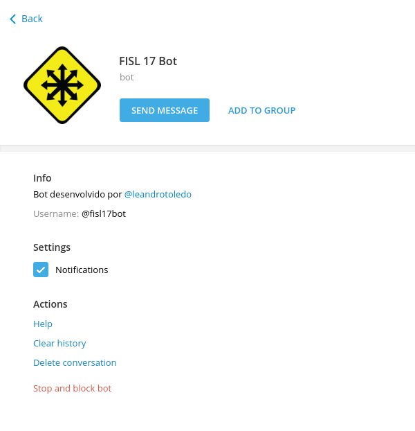

name: Desenvolvendo Bots para Telegram em Python
class: center, middle, inverse


# Desenvolvendo Bots para Telegram<br/>em Python

## FISL 17, Julho 2016

### Leandro Toledo

---

# Agenda

1. O que é o Telegram?
2. O que é um Bot?
3. Diferença entre robôs e humanos
4. The @BotFather
5. API
6. python-telegram-bot
7. Escrevendo seu primeiro Bot
8. Escrevendo seu primeiro Bot pythonico!
9. Breve história do meu primeiro software livre

---

class:center, middle

# App Makadu para perguntas e feedback


---

# O que é o Telegram?

- Lançado em Agosto de 2013
- 15 bilhões de mensagens entregues por dia
- 100 milhões de usuários mensais
- 350 mil novos usuários diariamente

---

class: center, middle


---

class: center, middle


---

# Código Fonte

- Telegram para Android (GNU GPL v2)

- Telegram para macOS (GNU GPL v2)

- Telegram para Web browsers (GNU GPL v3)

- Telegram Desktop (GNU GPL v3)

- Telegram CLI (GNU GPL v2)

- Telegram para iPhone (GNU GPL v2)

- Telegram para WP (GNU GPL v2)

<br /><br /><br />

.center[https://telegram.org/apps]

---

class: center, middle


---

# O que é um Bot?

> Bots são contas do Telegram operadas por software - não por pessoas - e normalmente possuem características de inteligência artificial.
>
> Bots podem fazer qualquer coisa - ensinar, tocar, buscar, distribuir, relembrar, conectar, integrar com outros serviços, ou até encaminhar comandos para Internet das Coisas.
>
> <cite>- Telegram blog</cite>

---

# Diferença entre robôs e humanos

1. Bots *não* têm status (online/offline) ou indicador de última vez visualizado.
--

2. Bots *não* podem iniciar conversas.
--

3. Bots *têm* armazenamento em nuvem limitado.
--

4. Bots *sempre terão* usuários terminados com *bot*. *
--

5. Bots adicionados a grupos *não receberão* todas as mensagens por padrão.
--

6. Bots podem ser linkados por `telegram.me/<bot_username>`.

---

# Exemplos de Bots

- `@music`
- `@vote`
- `@like`
- `@edrobot`
- `@GitHub_bot`
- `@TriviaBot`
- `@mau_mau_bot`
- `@myinstantsbot`
- `@dotaresponsesbot`
- `@TwitterForwarderBot`

---

class: center
# The @BotFather
> #### Um Bot para a todos governar, Um Bot para encontrá-los,
> #### Um Bot para a todos trazer e na escuridão aprisioná-los
>
> <cite>- O Senhor dos Bots, J.R.R. Tolkien</cite>


---

# The Botfather: Criando um novo bot

1. `/newbot`
--

2. Nome para o Bot. Ex.: **FISL 17 Bot**
--

3. Nome de usuário para o Bot. Ex.: **fisl17bot** (tem que terminar com 'bot')
--

4. Guarde o Token gerado.

---

class: center, middle

#### .left[@BotFather: `/newbot`]


---

# The Botfather: Adicionando comandos

1. `/setcommands`
--

2. Adicione todos os comandos no seguinte formato:
```yaml
comando1 - Descrição
comando2 - Outra descrição
```

---

class: center, middle

#### .left[@BotFather: `/newcommand`]


---

# The Botfather: Outros ajustes

1. `/setdescription`
--

2. `/setabouttext`
--

3. `/setprivacy`
--

4. `/setjoingroups`
--

5. `/help`

---

class: center, middle

#### .left[@FISL17Bot]


---

class: center, middle

#### .left[@FISL17Bot: `Sobre`]



---

# API

- A API de Bots é uma API HTTP Rest. Suporta requisições em **GET** e **POST**.
--


### Fazendo requisições:

- Todas as consultas *devem* ser requisitadas através de **HTTPS** e nesta forma:
`https://api.telegram.org/bot<token>/<método>`
--

- Todas as consultas *devem* ser feitas usando **UTF-8**.
--

- Todos os métodos são *case-insensitive*.
--

- A resposta é um objeto **JSON** que possui:
    - um campo 'ok': *true* ou *false*
--
    - um campo 'result' se 'ok' for *true*
--
    - um campo 'description' se 'ok' for *false*
--
    - um campo 'error_code' em caso de erros

---

# API


### Fazendo requisições:

- Métodos:
    - `getMe`
--
    - `getUpdates`
--
    - `sendMessage`
--
    - `sendPhoto`
--
    - `sendAudio`
--
    - `sendDocument`
--
    - `sendVideo`
--
    - `sendVoice`
--
    - `sendLocation`
--
    - `kickChatMember`
--
    - `leaveChat`
--
    - `unbanChatMember`
--
    - Todos os métodos em `core.telegram.org/bots/api`

---

class: center, middle

#### .left[API: `getMe`]


---

class: center, middle

#### .left[API: `getUpdates`]


---

class: center, middle

#### .left[API: `sendMessage`]


---

.center[]

#### Bots Pythonicos!

- Interface para a API

- Não reinvente a roda

- Concentre-se na lógica do seu Bot

- LGPLv3

- Python 2.6+ / Python 3.3+

- 93% do codebase testado


---

.center[]

#### Instalar é fácil!
```bash
pip install python-telegram-bot
```
--

#### Usar é ainda mais simples!
```python
>>> import telegram
>>> bot = telegram.Bot(token='<token>')
```

---

# Alguns exemplos
* Informações sobre o Bot:
```python
>>> print(bot.getMe())
```

* Processar novos updates:
```python
>>> updates = bot.getUpdates()
>>> print([u.message.text for u in updates])
```

* Enviar uma mensagem a um usuário:
```python
>>> chat_id = bot.getUpdates()[-1].message.chat_id
>>> bot.sendMessage(chat_id=chat_id, text="Moo!")
```

* Enviar um emoji:
```python
>>> bot.sendMessage(chat_id=chat_id, text=telegram.Emoji.PILE_OF_POO)
```

---

# Escrevendo seu primeiro Bot!

```python
import telegram


def hello():
    bot = telegram.Bot('257076271:AAEsldoAW_1puD9Sv7zAGRjQ1qBbkJsBb60')

    update_id = None

    while True:
        for update in bot.getUpdates(offset=update_id):
            update_id = update.update_id + 1

            if update.message:
                text = 'Hello {}!'.format(update.message.from_user.first_name)
                bot.sendMessage(update.message.chat_id, text)

if __name__ == '__main__':
    hello()
```

---

# Escrevendo seu primeiro Bot pythonico!
### MessageHandler

```python
from telegram.ext import Updater, MessageHandler, Filters


def echo(bot, update):
    bot.sendMessage(update.message.chat_id, text=update.message.text)


updater = Updater('257076271:AAEsldoAW_1puD9Sv7zAGRjQ1qBbkJsBb60')

updater.dispatcher.add_handler(MessageHandler([Filters.text], echo))

updater.start_polling()
updater.idle()
```

---

# Escrevendo seu primeiro Bot pythonico!
### CommandHandler

```python
from telegram.ext import Updater, CommandHandler


def hello(bot, update):
    text = 'Hello {}!'.format(update.message.from_user.first_name)
    bot.sendMessage(update.message.chat_id, text)


updater = Updater('257076271:AAEsldoAW_1puD9Sv7zAGRjQ1qBbkJsBb60')

updater.dispatcher.add_handler(CommandHandler('hello', hello))

updater.start_polling()
updater.idle()
```

---

# Escrevendo seu primeiro Bot pythonico!
### CommandHandler com argumentos

```python
from telegram.ext import Updater, CommandHandler


def sayhito(bot, update, args):
    text = 'Hello {}!'.format(args[0])
    bot.sendMessage(update.message.chat_id, text)


updater = Updater('257076271:AAEsldoAW_1puD9Sv7zAGRjQ1qBbkJsBb60')

updater.dispatcher.add_handler(CommandHandler('sayhito', sayhito, pass_args=True))

updater.start_polling()
updater.idle()
```

---

# Escrevendo seu primeiro Bot pythonico!
### ErrorHandler

```python
from telegram.error import *


def error(bot, update, error):
    try:
        raise error
    except Unauthorized:
        # Bot bloqueado, remover chat_id da lista de usuários
    except BadRequest:
        # Requisição mal formatada
    except TimedOut:
        # Requisição lenta
    except NetworkError:
        # Requisição com outros erros de erro
    except TelegramError:
        # Todos os outros erros do Telegram


dp.add_error_handler(error)
```

---

# Outras classes

- JobQueue
--

- RegexHandler
--

- InlineQueryHandler
--

- ConversationHandler (em desenvolvimento)
--

- Mais em `github.com/python-telegram-bot/python-telegram-bot/wiki`

---

# Onde conseguir ajuda

- Documentação: 
    - `pythonhosted.org/python-telegram-bot`


- Wiki: 
    - `github.com/python-telegram-bot/python-telegram-bot/wiki`


- Comunidade (inglês): 
    - telegram.me/pythontelegrambotgroup


- Bug tracker:
    - github.com/python-telegram-bot/python-telegram-bot/issues

---

# Onde ajudar

- Documentação: 
    - `pythonhosted.org/python-telegram-bot`


- Wiki: 
    - `github.com/python-telegram-bot/python-telegram-bot/wiki`


- Comunidade (inglês): 
    - telegram.me/pythontelegrambotgroup


- Bug tracker:
    - github.com/python-telegram-bot/python-telegram-bot/issues

---

# Breve história do meu primeiro software livre

---

class: center, middle


---

class: center, middle


---

class: center, middle


---

# Perguntas?

---

class: center, middle

# Obrigado!

## Leandro Toledo

leandrotoledodesouza@gmail.com

github.com/leandrotoledo

@leandrotoledo (Telegram / Keybase.io)

#### leandrotoledo.github.io/telegram-bot-com-python